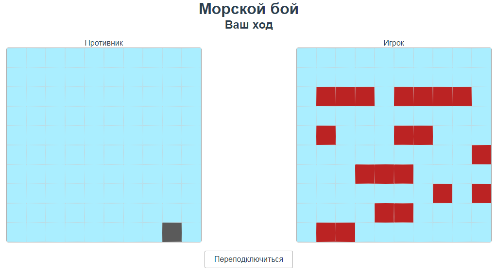
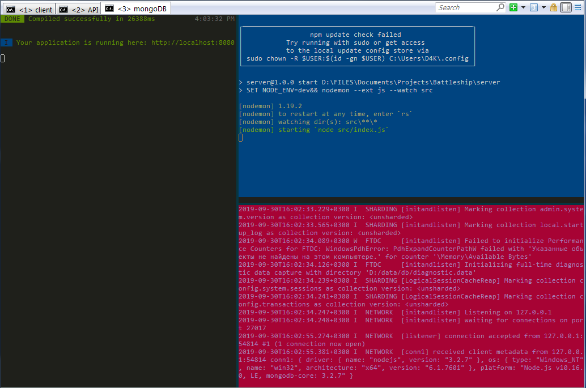

# Battleship-MEVN-App

The implementation of the battleship game.

FullStack Single Page Application (SPA) using MEVN stack (MongoDB, Express, Vue JS, and Node.js)



## how to instal
1. instal [MongoDB](https://www.mongodb.com/download-center/community)
2. instal [Node.JS](https://nodejs.org/en/)
3. copy this project
5. install dependencies (using cmd/powershell on windows and default terminal on Linux) using following commands
``` bash
$ cd ../Battleship-MEVN-App/server
$ npm install
$ cd ../Battleship-MEVN-App/client
$ npm install
``` 

## how to run app
6. run MongoDB (doesn't needed if app actually runs as a service)
    
    `$ mongod`
    
7. run server
    
    `$ cd ../Battleship-MEVN-App/server & npm start`
    
8. run client
    
    `$ cd ../Battleship-MEVN-App/client & npm start`
    
9. (optional, instead of points 6-8) instal [ConEmu](http://conemu.ru/ru/) and run dev.bat

10. open http://localhost:8080/
11. ???
12. PROFIT


Diferent browser needed for a second player (Due to JWT auth). Enjoy!